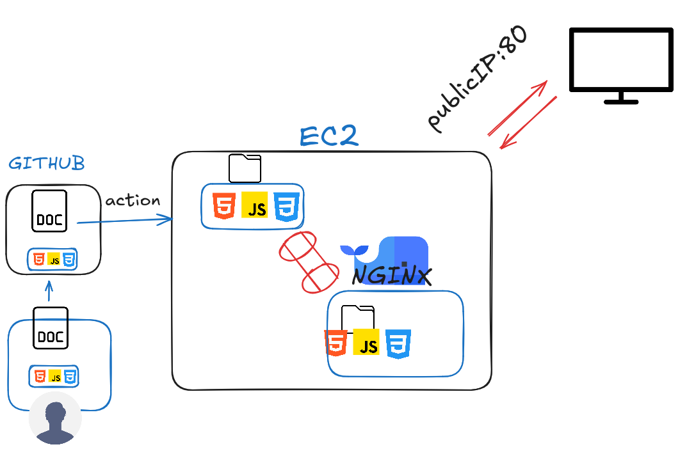
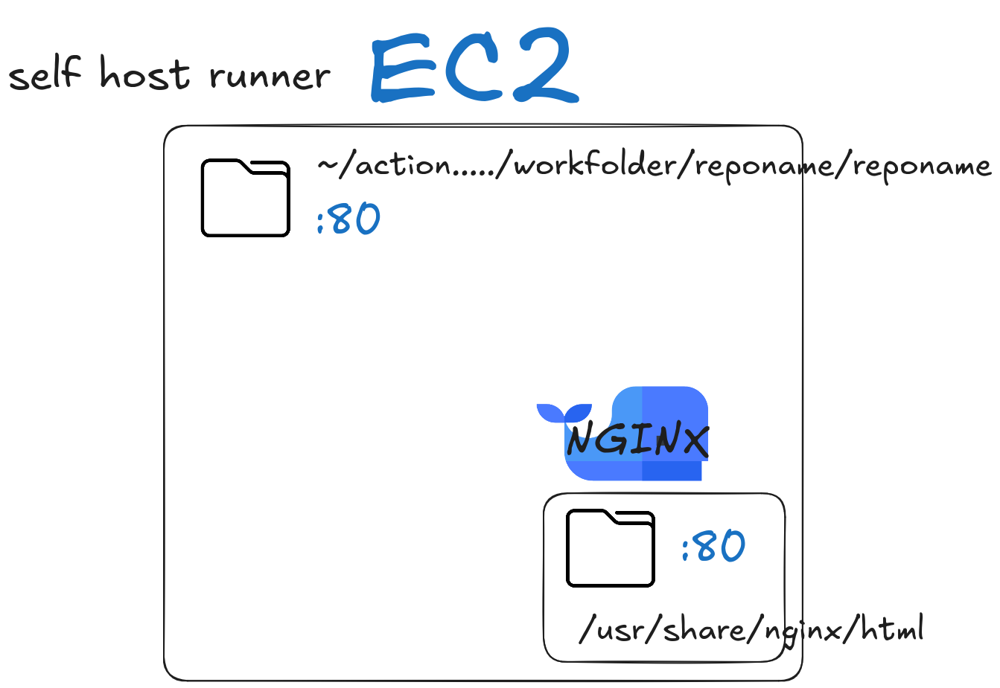

# Deploy Web site on nginx from docker (EC2)

## Diagram flow



## Diagram nginx with docker



## EC2 configuration
Prerequisites
* docker downloaded
* nginx image

### Runner
Configure the runer in the chosen repository.
In the section:


### Nginx image
Create an nginx instance that runs on the desired port, in this case 80 with a volume that links a folder outside the ec2 machine with one inside docker. As shown in the [image](#diagram-nginx-with-docker)
### Nginx configuration
Inside the configuration file `default.conf` in the path `/etc/nginx/conf.d/` the folder path that points to the service exposed on port 80 will be modified by adding the folder `/dist` that contains the website files. Example:
___
`default.conf`
```
server {
    listen       80;
    listen  [::]:80;
    server_name  localhost;

    #access_log  /var/log/nginx/host.access.log  main;

    location / {
        root   /usr/share/nginx/html/dist;
        index  index.html index.htm;
    }
```